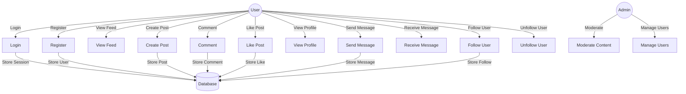
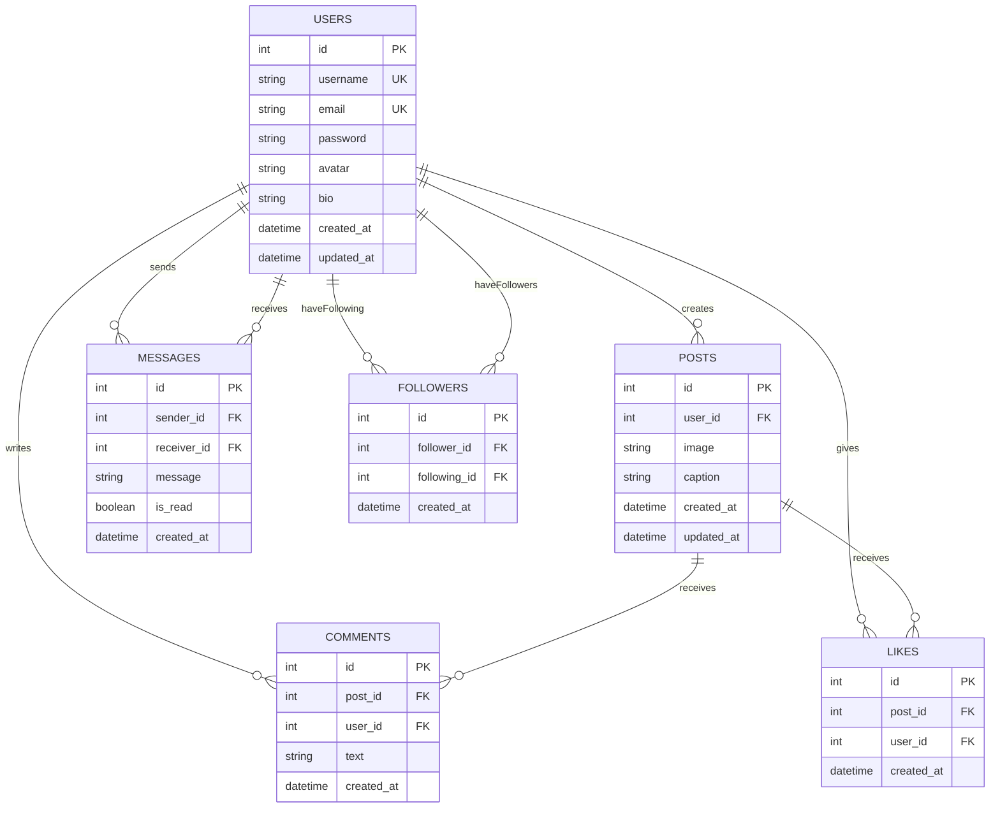
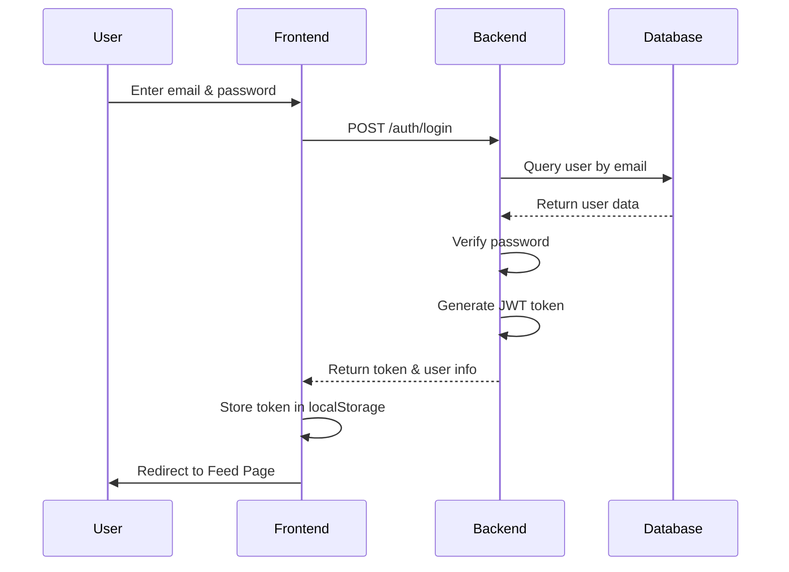
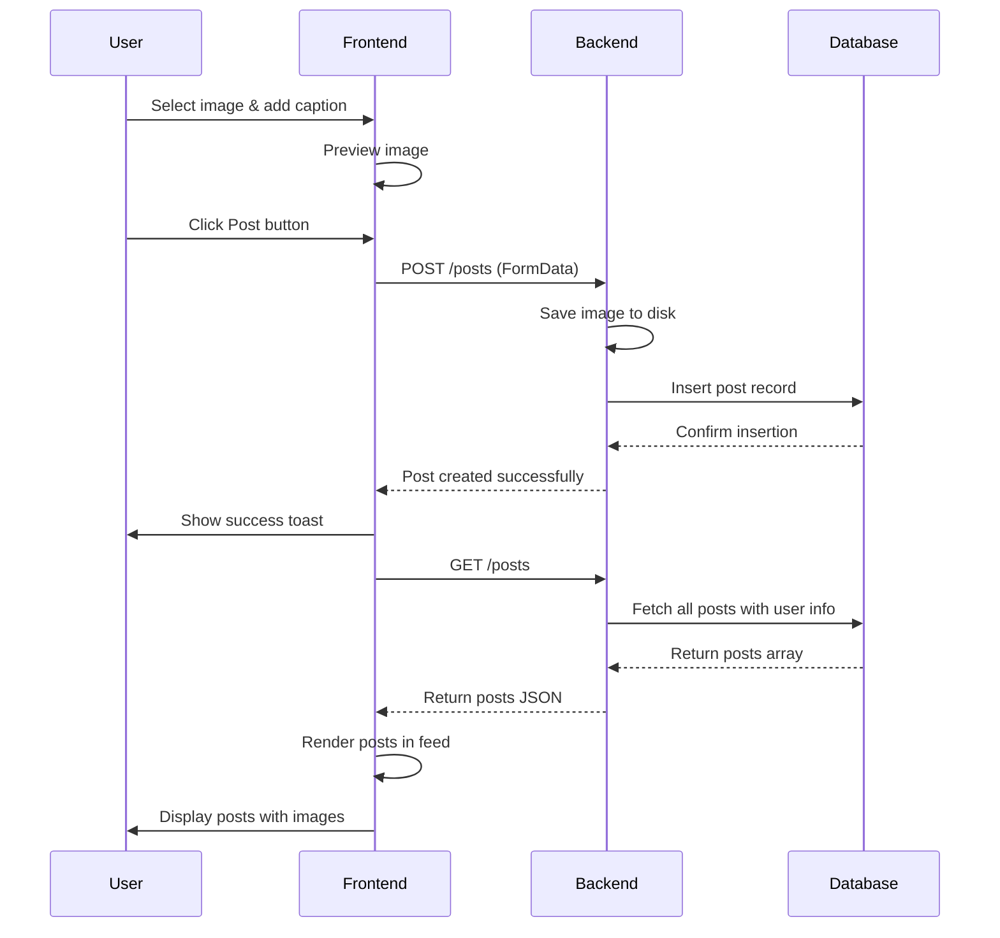

<!-- GMinsta - UML Use Case Diagram -->
<!-- Open this file in a markdown viewer or use https://mermaid.live -->

# GMinsta - UML Diagrams

## Use Case Diagram



## Class Diagram

```mermaid
classDiagram
    class User {
        -int id
        -string username
        -string email
        -string password
        -string avatar
        -string bio
        -datetime created_at
        +register()
        +login()
        +updateProfile()
        +getProfile()
    }
    
    class Post {
        -int id
        -int user_id
        -string image
        -string caption
        -datetime created_at
        +createPost()
        +deletePost()
        +getPost()
        +updateCaption()
    }
    
    class Comment {
        -int id
        -int post_id
        -int user_id
        -string text
        -datetime created_at
        +addComment()
        +deleteComment()
    }
    
    class Like {
        -int id
        -int post_id
        -int user_id
        -datetime created_at
        +likePost()
        +unlikePost()
    }
    
    class Message {
        -int id
        -int sender_id
        -int receiver_id
        -string message
        -boolean is_read
        -datetime created_at
        +sendMessage()
        +markAsRead()
    }
    
    class Follower {
        -int id
        -int follower_id
        -int following_id
        -datetime created_at
        +followUser()
        +unfollowUser()
    }
    
    User "1" -->|creates| "many" Post
    User "1" -->|writes| "many" Comment
    User "1" -->|gives| "many" Like
    User "1" -->|sends/receives| "many" Message
    User "1" -->|follows| "many" Follower
    Post "1" -->|receives| "many" Comment
    Post "1" -->|receives| "many" Like
```

## Entity Relationship Diagram (ERD)



## Sequence Diagram - User Login Flow



## Sequence Diagram - Create & View Post Flow



## Activity Diagram - Post Like Flow

```mermaid
activity
    start
    :User views post;
    :Click like button;
    :Check if already liked;
    if (Already liked?) then
        :Unlike the post;
        :Delete from likes table;
    else
        :Like the post;
        :Insert into likes table;
    endif
    :Update like count;
    :Display in UI;
    stop
```
